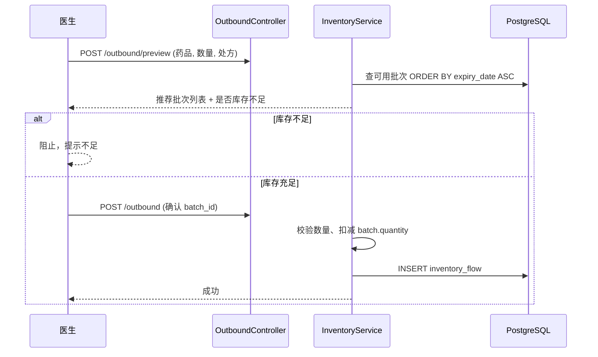

# v0.1 架构设计

> 分支：`v0.1-skeleton` | 状态：已定稿  
> 确认后由**开发者**对话实现骨架代码；本阶段不写业务实现。

---

## 0. 设计摘要（一页）

| 项 | 决策 |
| --- | --- |
| 架构 | 模块化单体：一个 Spring Boot + 一个 Vue SPA |
| 数据库 | PostgreSQL 16，`pgvector/pgvector:pg16` 镜像 |
| 扩展 | v0.1 Flyway V0 一次性启用 `vector`、`pg_trgm` |
| 迁移 | Flyway 按版本 V0–V7 递增，业务表分版本建 |
| 外键 | **逻辑外键**（应用层校验 + 索引），不用 DB 级 FK |
| 金额/数量 | `numeric`，禁止 float |
| 库存 | 只改流水，禁止直接改库存数 |
| 出库 | FEFO 推荐批次 → 用户确认 → 扣减；不足则阻止 |
| 患者 | 必填身份证号；年龄从证号/出生日期推算 |
| 病历 | 含既往史 `past_history` |
| AI | v0.9 仅 Noop + `ai_draft`；T1 脱敏见 `AI架构.md` |

**v0.1 本分支交付**：可启动的空后端 + 空前端 + docker-compose + Flyway V0 + `.env.example` + 占位包。  
**v0.1 不做**：业务表、登录、CRUD、真实 AI 调用。

---

## 1. 设计目标（v0.1 编码范围）

| 交付 | 说明 |
| --- | --- |
| Spring Boot 可启动 | Java 21，虚拟线程，健康检查 `GET /api/health` |
| Vue 可启动 | Vite 开发服或 Nginx 静态托管 |
| PostgreSQL 可连接 | pgvector 镜像，扩展在首迁迁移中启用 |
| Flyway 可执行 | `V0__enable_extensions.sql` 为第一条迁移 |
| 目录与占位 | `ai` / `agent` 空包；`.env.example`；`scripts/` 占位脚本 |
| 上传目录预留 | `uploads/images`、`uploads/audio`（v1.4 / v1.1） |

---

## 2. PostgreSQL 扩展策略

### Docker 镜像

```yaml
postgres:
  image: pgvector/pgvector:pg16
```

### Flyway V0

```sql
CREATE EXTENSION IF NOT EXISTS vector;   -- v2.2 RAG
CREATE EXTENSION IF NOT EXISTS pg_trgm;  -- v0.3+ 模糊搜索
```

验收：

```sql
SELECT extname, extversion FROM pg_extension WHERE extname IN ('vector', 'pg_trgm');
```

---

## 3. 项目目录结构

```text
发凤村卫生室/
├── backend/
│   ├── pom.xml
│   ├── Dockerfile
│   └── src/
│       ├── main/
│       │   ├── java/com/fafeng/clinic/
│       │   │   ├── ClinicApplication.java
│       │   │   ├── config/              # Spring 配置（Security 占位 v0.2）
│       │   │   ├── common/            # v0.2：统一返回、异常、工具
│       │   │   ├── system/            # v0.2：用户、设置、审计
│       │   │   ├── medicine/          # v0.3
│       │   │   ├── inventory/         # v0.6
│       │   │   ├── patient/           # v0.4
│       │   │   ├── clinic/            # v0.4–v0.5 病历、处方
│       │   │   ├── ai/                # v0.1 空包；v0.9 实装
│       │   │   └── agent/             # v0.1 空包；v2.0 实装
│       │   └── resources/
│       │       ├── application.yml
│       │       └── db/migration/
│       │           └── V0__enable_extensions.sql
│       └── test/
│           └── java/com/fafeng/clinic/
│               └── ClinicApplicationTests.java
├── frontend/
│   ├── package.json
│   ├── vite.config.ts
│   ├── tsconfig.json
│   ├── Dockerfile
│   ├── nginx.conf                     # 生产静态托管 + /api 反代
│   ├── index.html
│   └── src/
│       ├── main.ts
│       ├── App.vue
│       ├── api/                       # Axios 封装、按模块分文件
│       ├── assets/
│       ├── components/                # 通用组件
│       ├── composables/
│       ├── layouts/                   # MainLayout、Sidebar、Tabs（v1.0.1）
│       ├── router/index.ts            # v0.1 占位路由
│       ├── stores/                    # Pinia
│       ├── styles/
│       ├── types/
│       └── views/                     # 按业务域分子目录
│           ├── login/
│           ├── dashboard/
│           ├── medicine/
│           ├── patient/
│           ├── visit/
│           ├── prescription/
│           ├── inventory/
│           ├── settings/
│           └── ai/                    # v0.9 占位「功能开发中」
├── scripts/
│   ├── backup.ps1                     # v1.0 实装
│   └── restore.ps1
├── uploads/                           # .gitkeep；运行时挂载
│   ├── images/
│   └── audio/
├── docker-compose.yml
├── .env.example
├── .gitignore
├── README.md
└── docs/
```

---

## 4. 后端包结构（各层约定）

每个业务包内统一分层：

```text
{module}/
  controller/    # 仅接收请求、返回响应
  service/       # 业务编排
  mapper/        # MyBatis-Plus
  entity/        # 数据库实体
  dto/           # 入参
  vo/            # 出参
```

| 包 | 版本 | 职责 |
| --- | --- | --- |
| `common` | v0.2 | `Result<T>`、全局异常、校验、IdCardUtils、Desensitizer（v1.3） |
| `system` | v0.2 | 密码 hash、登录 Session/JWT、sys_setting、audit_log |
| `medicine` | v0.3 | 药品 CRUD、单位换算、条码、拼音/trgm 搜索 |
| `patient` | v0.4 | 患者 CRUD、身份证解析、年龄推算 |
| `clinic` | v0.4–v0.5 | clinic_visit、prescription、prescription_item、打印数据 |
| `inventory` | v0.6 | 批次、流水、入出库、FEFO 推荐、预警 |
| `ai` | v0.9 | AiProvider、NoopAiProvider、ai_draft CRUD |
| `agent` | v2.0 | AgentTool 注册、编排、execution_log |

---

## 5. 前端目录与路由（v0.1 占位）

| 路由 | 页面 | 版本 |
| --- | --- | --- |
| `/login` | 登录 | v0.2 |
| `/setup` | 首次设置密码 | v0.2 |
| `/` | 首页（预警摘要） | v0.6 |
| `/medicine` | 药品列表 | v0.3 |
| `/medicine/:id` | 药品编辑 | v0.3 |
| `/patient` | 患者列表 | v0.4 |
| `/patient/:id` | 患者详情 + 历史病历 | v0.4 |
| `/visit/new` | 病历录入 | v0.4 |
| `/visit/:id` | 病历详情 | v0.4 |
| `/prescription/new` | 处方编辑 | v0.5 |
| `/prescription/:id/print` | 处方打印 | v0.5 |
| `/inventory/inbound` | 入库 | v0.6 |
| `/inventory/outbound` | 出库 | v0.6 |
| `/inventory/flows` | 库存流水 | v0.6 |
| `/inventory/alerts` | 预警 | v0.6 |
| `/settings` | 系统设置 | v0.2 |
| `/ai` | AI 助手占位 | v0.9 |

v0.1 前端：仅 `HomeView`（显示「发凤村卫生室诊所系统 v0.1 骨架」）+ 占位路由文件。

**v1.0.1 更新**：登录后使用 `MainLayout`（左侧可收起菜单 + 顶栏多标签 + keep-alive）。详见 [`../给Agent/前端布局约定.md`](../给Agent/前端布局约定.md)。

---

## 6. 数据库表设计

### 6.1 Flyway 版本规划

| 迁移 | ROADMAP | 表 |
| --- | --- | --- |
| V0 | v0.1 | 扩展 |
| V1 | v0.2 | sys_user, sys_setting, audit_log |
| V2 | v0.3 | medicine, medicine_unit_conversion, medicine_barcode |
| V3 | v0.4 | patient, clinic_visit |
| V4 | v0.5 | prescription, prescription_item |
| V5 | v0.6 | inventory_batch, inventory_flow |
| V6 | v0.9 | ai_draft |
| V7 | v2.2 | visit_embedding |

### 6.2 sys_user（V1 / v0.2）

| 字段 | 类型 | 说明 |
| --- | --- | --- |
| id | bigserial PK | |
| password_hash | varchar(128) | BCrypt |
| must_change_password | boolean | 首次设置后 false |
| created_at | timestamptz | |
| updated_at | timestamptz | |

单用户模式，仅一行记录。

### 6.3 sys_setting（V1 / v0.2）

| 字段 | 类型 | 说明 |
| --- | --- | --- |
| id | bigserial PK | |
| setting_key | varchar(64) UNIQUE | |
| setting_value | text | |
| remark | varchar(256) | |
| updated_at | timestamptz | |

### 6.4 audit_log（V1 / v0.2）

| 字段 | 类型 | 说明 |
| --- | --- | --- |
| id | bigserial PK | |
| action | varchar(64) | LOGIN, OUTBOUND, INBOUND 等 |
| target_type | varchar(32) | medicine, patient… |
| target_id | bigint | 可空 |
| detail | jsonb | 摘要 |
| operator | varchar(64) | 单用户固定 admin |
| created_at | timestamptz | |

索引：`(created_at DESC)`, `(target_type, target_id)`

### 6.5 medicine（V2 / v0.3）

| 字段 | 类型 | 说明 |
| --- | --- | --- |
| id | bigserial PK | |
| name | varchar(128) | 药品名称 |
| generic_name | varchar(128) | 通用名 |
| dosage_form | varchar(32) | 剂型 |
| specification | varchar(64) | 规格 |
| base_unit | varchar(16) | 基本单位（片/颗/ml 描述在规格） |
| package_unit | varchar(16) | 包装单位 |
| manufacturer | varchar(128) | |
| purchase_price | numeric(12,2) | 进货单价 |
| stock_threshold | numeric(14,3) | **基本单位**下限 |
| pinyin_abbr | varchar(64) | 拼音首字母，搜索用 |
| remark | text | |
| status | varchar(16) | ACTIVE / INACTIVE |
| created_at / updated_at | timestamptz | |

索引：`(name)`, `(pinyin_abbr)`, GIN `(name gin_trgm_ops)` 可选

### 6.6 medicine_unit_conversion（V2 / v0.3）

| 字段 | 类型 | 说明 |
| --- | --- | --- |
| id | bigserial PK | |
| medicine_id | bigint | 索引 |
| from_unit | varchar(16) | |
| to_unit | varchar(16) | |
| factor | int | 整数换算，如 1 盒=12 片 → factor=12 |
| created_at | timestamptz | |

### 6.7 medicine_barcode（V2 / v0.3）

| 字段 | 类型 | 说明 |
| --- | --- | --- |
| id | bigserial PK | |
| medicine_id | bigint | 索引 |
| barcode | varchar(32) UNIQUE | |
| remark | varchar(128) | |
| created_at | timestamptz | |

### 6.8 patient（V3 / v0.4）

| 字段 | 类型 | 说明 |
| --- | --- | --- |
| id | bigserial PK | |
| name | varchar(64) | |
| gender | varchar(8) | M/F/UNKNOWN |
| id_card | varchar(18) | **必填**，UNIQUE |
| birth_date | date | 可从证号解析 |
| age | int | 展示用 |
| age_manual | boolean | true=手填，false=系统算 |
| phone | varchar(20) | |
| address | varchar(256) | |
| remark | text | |
| status | varchar(16) | ACTIVE / INACTIVE |
| created_at / updated_at | timestamptz | |

索引：`(name)`, `(phone)`, `(id_card)`

**年龄推算**（Service 层，保存/更新时）：

1. 有合法 18 位身份证 → 解析出生日期 → 计算周岁 → `age_manual=false`
2. 无身份证但有 `birth_date` → 计算周岁 → `age_manual=false`
3. 否则保留手填 `age`，`age_manual=true`

### 6.9 clinic_visit（V3 / v0.4）

| 字段 | 类型 | 说明 |
| --- | --- | --- |
| id | bigserial PK | |
| patient_id | bigint | 索引 |
| visit_time | timestamptz | |
| chief_complaint | text | 主诉 |
| present_illness | text | 现病史 |
| past_history | text | **既往史** |
| temperature | numeric(4,1) | 体温 |
| blood_pressure | varchar(16) | 血压 |
| spo2 | numeric(5,2) | 血氧 |
| etco2 | numeric(5,2) | 呼末二氧化碳 |
| heart_rate | int | 心率 |
| pulse | varchar(64) | 脉象 |
| allergy_history | text | 过敏史 |
| diagnosis | text | 诊断 |
| treatment | text | 处理意见 |
| remark | text | |
| status | varchar(16) | ACTIVE / VOID |
| created_at / updated_at | timestamptz | |

索引：`(patient_id, visit_time DESC)`

### 6.10 prescription（V4 / v0.5）

| 字段 | 类型 | 说明 |
| --- | --- | --- |
| id | bigserial PK | |
| patient_id | bigint | 索引 |
| visit_id | bigint | 索引 |
| prescription_date | date | |
| diagnosis | text | 冗余便于打印 |
| status | varchar(16) | DRAFT / CONFIRMED / VOID |
| created_at / updated_at | timestamptz | |

### 6.11 prescription_item（V4 / v0.5）

| 字段 | 类型 | 说明 |
| --- | --- | --- |
| id | bigserial PK | |
| prescription_id | bigint | 索引 |
| medicine_id | bigint | |
| dosage_form | varchar(32) | |
| medicine_name | varchar(128) | 快照 |
| specification | varchar(64) | |
| quantity | numeric(14,3) | |
| unit | varchar(16) | |
| usage | varchar(256) | 用法 |
| sort_order | int | |
| created_at | timestamptz | |

### 6.12 inventory_batch（V5 / v0.6）

| 字段 | 类型 | 说明 |
| --- | --- | --- |
| id | bigserial PK | |
| medicine_id | bigint | 索引 |
| batch_no | varchar(64) | |
| expiry_date | date | FEFO 排序 |
| quantity | numeric(14,3) | 当前余量（基本单位） |
| purchase_price | numeric(12,2) | |
| supplier | varchar(128) | |
| status | varchar(16) | ACTIVE / DEPLETED |
| created_at / updated_at | timestamptz | |

唯一索引：`(medicine_id, batch_no)`  
索引：`(medicine_id, expiry_date)` — FEFO

### 6.13 inventory_flow（V5 / v0.6）

| 字段 | 类型 | 说明 |
| --- | --- | --- |
| id | bigserial PK | |
| medicine_id | bigint | 索引 |
| batch_id | bigint | 可空（盘点类） |
| flow_type | varchar(16) | INBOUND / OUTBOUND / ADJUST |
| quantity_change | numeric(14,3) | 正入负出 |
| quantity_before | numeric(14,3) | |
| quantity_after | numeric(14,3) | |
| unit | varchar(16) | |
| patient_id | bigint | 出库必填 |
| prescription_id | bigint | 出库必填 |
| reason | varchar(256) | 盘点/损耗原因 |
| remark | text | |
| operator | varchar(64) | |
| created_at | timestamptz | |

索引：`(medicine_id, created_at DESC)`, `(prescription_id)`

### 6.14 ai_draft（V6 / v0.9）

| 字段 | 类型 | 说明 |
| --- | --- | --- |
| id | bigserial PK | |
| draft_type | varchar(16) | INBOUND / VISIT / OUTBOUND / QUERY |
| status | varchar(16) | PENDING / APPROVED / REJECTED |
| payload | jsonb | 草稿 JSON |
| source | varchar(32) | noop / deepseek / ocr / agent |
| created_at / updated_at | timestamptz | |

### 6.15 visit_embedding（V7 / v2.2）

| 字段 | 类型 | 说明 |
| --- | --- | --- |
| id | bigserial PK | |
| visit_id | bigint UNIQUE | |
| embedding | vector(1024) | 默认 BAAI/bge-m3（硅基流动） |
| text_summary | text | 脱敏后摘要 |
| embedding_model | varchar(128) | 模型标识 |
| embedding_dimensions | int | 默认 1024 |
| source_updated_at | timestamptz | 快照 clinic_visit.updated_at |
| synced_at | timestamptz | |

---

## 7. API 清单（按版本）

统一前缀 `/api`，统一响应 `Result<T>`（v0.2 定义）。

### v0.1

| 方法 | 路径 | 说明 |
| --- | --- | --- |
| GET | `/api/health` | 健康检查 `{ status: "UP" }` |

### v0.2 系统

| 方法 | 路径 | 说明 |
| --- | --- | --- |
| GET | `/api/system/setup-status` | 是否需首次设密 |
| POST | `/api/system/setup-password` | 首次设密 |
| POST | `/api/auth/login` | 登录 |
| POST | `/api/auth/logout` | 登出 |
| POST | `/api/auth/change-password` | 改密 |
| GET | `/api/settings` | 读取配置 |
| PUT | `/api/settings/{key}` | 更新配置 |

### v0.3 药品

| 方法 | 路径 | 说明 |
| --- | --- | --- |
| GET | `/api/medicines` | 分页搜索（name/pinyin/barcode） |
| POST | `/api/medicines` | 新增 |
| GET | `/api/medicines/{id}` | 详情 |
| PUT | `/api/medicines/{id}` | 编辑 |
| PATCH | `/api/medicines/{id}/status` | 停用/启用 |
| GET/POST/DELETE | `/api/medicines/{id}/conversions` | 单位换算 |
| GET/POST/DELETE | `/api/medicines/{id}/barcodes` | 条码 |

### v0.4 患者与病历

| 方法 | 路径 | 说明 |
| --- | --- | --- |
| GET | `/api/patients` | 搜索 |
| POST | `/api/patients` | 新增（含年龄推算） |
| GET/PUT | `/api/patients/{id}` | 详情/编辑 |
| GET | `/api/patients/{id}/visits` | 历史病历 |
| POST | `/api/visits` | 新建病历 |
| GET/PUT | `/api/visits/{id}` | 详情/编辑 |

### v0.5 处方

| 方法 | 路径 | 说明 |
| --- | --- | --- |
| POST | `/api/prescriptions` | 新建 |
| GET | `/api/prescriptions/{id}` | 详情（含明细） |
| PUT | `/api/prescriptions/{id}` | 编辑 |
| GET | `/api/prescriptions/{id}/print` | 打印数据 |
| POST | `/api/prescriptions/{id}/outbound-draft` | 生成待出库清单（数据结构，v0.6 手动出库） |

### v0.6 库存

| 方法 | 路径 | 说明 |
| --- | --- | --- |
| POST | `/api/inventory/inbound` | 入库 |
| POST | `/api/inventory/outbound/preview` | FEFO 推荐批次预览 |
| POST | `/api/inventory/outbound` | 确认批次后出库 |
| POST | `/api/inventory/adjust` | 盘点修正 |
| GET | `/api/inventory/batches` | 批次列表 |
| GET | `/api/inventory/flows` | 流水 |
| GET | `/api/inventory/alerts` | 不足 + 临期（3 月） |
| GET | `/api/dashboard/summary` | 首页摘要 |

### v0.7 扫码

| 方法 | 路径 | 说明 |
| --- | --- | --- |
| GET | `/api/medicines/by-barcode/{code}` | 条码匹配 |

### v0.8 Excel

| 方法 | 路径 | 说明 |
| --- | --- | --- |
| GET | `/api/import/medicine/template` | 下载模板 |
| POST | `/api/import/medicine/preview` | 预览 |
| POST | `/api/import/medicine/confirm` | 确认写入 |

### v0.9 AI

| 方法 | 路径 | 说明 |
| --- | --- | --- |
| GET | `/api/ai/status` | enabled / provider |
| GET/POST | `/api/ai/drafts` | 草稿列表/创建 |
| GET/PATCH | `/api/ai/drafts/{id}` | 详情/批准拒绝 |

### v2.0 Agent

| 方法 | 路径 | 说明 |
| --- | --- | --- |
| POST | `/api/agent/chat` | 自然语言 → 工具调用 |
| GET | `/api/agent/logs` | 执行日志 |

---

## 8. 关键业务流程

### 8.1 出库（FEFO + 用户确认）



约束：禁止跳过 preview 直接扣批；可多批拆分出库（后续迭代可 v1.5 扩展）。

### 8.2 患者年龄推算

```text
保存患者
  ├─ id_card 合法 18 位 → 解析 birth_date → age = 周岁 → age_manual=false
  ├─ 无 id_card 但有 birth_date → age = 周岁 → age_manual=false
  └─ 否则 → 使用请求中的 age → age_manual=true
```

`IdCardUtils` 放 `common` 包，含校验位验证。

### 8.3 库存变更

```text
任何库存变化 → 只通过 InventoryService
  → 更新 inventory_batch.quantity
  → 插入 inventory_flow（前后数量、关联患者/处方）
禁止：在 MedicineService 或直接 SQL 改库存
```

### 8.4 AI 草稿

```text
AI/Agent/OCR → 写 ai_draft (PENDING)
  → 前端确认页展示原文
  → APPROVED → 调用现有 InboundService / VisitService / OutboundService
  → REJECTED → 仅更新状态
禁止：AiProvider 直接写业务表
```

---

## 9. Docker Compose 设计

```yaml
services:
  postgres:
    image: pgvector/pgvector:pg16
    environment:
      POSTGRES_DB: ${POSTGRES_DB}
      POSTGRES_USER: ${POSTGRES_USER}
      POSTGRES_PASSWORD: ${POSTGRES_PASSWORD}
    volumes:
      - ${CLINIC_DATA_DIR}/postgres:/var/lib/postgresql/data
    ports:
      - "5432:5432"   # 开发可暴露；生产可去掉
    healthcheck:
      test: ["CMD-SHELL", "pg_isready -U ${POSTGRES_USER}"]

  backend:
    build: ./backend
    depends_on:
      postgres:
        condition: service_healthy
    environment:
      SPRING_DATASOURCE_URL: jdbc:postgresql://postgres:5432/${POSTGRES_DB}
      SPRING_DATASOURCE_USERNAME: ${POSTGRES_USER}
      SPRING_DATASOURCE_PASSWORD: ${POSTGRES_PASSWORD}
    volumes:
      - ${CLINIC_DATA_DIR}/uploads:/app/uploads
    ports:
      - "8080:8080"

  frontend:
    build: ./frontend
    depends_on:
      - backend
    ports:
      - "80:80"
```

---

## 10. .env.example 骨架

```env
# PostgreSQL
POSTGRES_DB=clinic
POSTGRES_USER=clinic
POSTGRES_PASSWORD=change_me

# 数据目录（宿主机，对应 DEPLOYMENT.md）
CLINIC_DATA_DIR=./clinic-data

# Spring
SPRING_PROFILES_ACTIVE=prod

# AI（v0.9 预留，默认关闭）
CLINIC_AI_ENABLED=false
CLINIC_AI_PROVIDER=noop
# CLINIC_DEEPSEEK_API_KEY=
# CLINIC_DEEPSEEK_BASE_URL=https://api.deepseek.com

# Whisper（v1.1 预留）
# CLINIC_WHISPER_URL=http://whisper-service:9000

# OCR（v1.4 预留）
# CLINIC_OCR_URL=http://ocr-service:8000
```

---

## 11. 技术栈与依赖（骨架期）

### 后端 pom 核心依赖

- spring-boot-starter-web
- spring-boot-starter-validation
- spring-boot-starter-security（v0.1 可全放行，v0.2 实装）
- mybatis-plus-spring-boot3-starter
- flyway-core + flyway-database-postgresql
- postgresql

### 前端 package 核心依赖

- vue ^3.4
- vue-router ^4
- pinia ^2
- element-plus ^2
- axios ^1
- typescript + vite

---

## 12. v0.2–v1.0 版本依赖

```text
v0.1 ─┬─ v0.2 ─┬─ v0.3 ─┬─ v0.5 ─ v0.6 ─ v0.7
      │         │        └─ v0.4 ─┘      └─ v0.8
      └─ v0.9 ─ v1.0
```

建议编码顺序：v0.1 → v0.2 → v0.3 → v0.4 → v0.5 → v0.6 → v0.7 → v0.8 → v0.9 → v1.0

---

## 13. 风险与待确认

| 项 | 说明 | 状态 |
| --- | --- | --- |
| T1 脱敏 | 见 `AI架构.md` §4 | 已确认 |
| T2 FEFO | 推荐 + 用户确认 | 已确认 |
| T3 库存不足 | 阻止出库 | 已确认 |
| T4/T5 年龄/身份证 | 证号必填、自动推算 | 已确认 |
| T6 库存下限单位 | 基本单位存储 | 已确认 |
| 登录方案 | Session Cookie vs JWT | **建议 v0.2 用 Session + HttpOnly Cookie**（单用户台式机） |
| 拼音搜索 | 存储 `pinyin_abbr` 字段 vs 运行时转换 | **建议 v0.3 存字段 + pg_trgm 辅搜** |
| 出库多批拆分 | 一次出库跨多个批次 | v0.6 先支持单批；不足时提示拆单或 v1.5 |
| vector 维度 | visit_embedding 列宽 | v2.2 按所选 embedding 模型定 |

---

## 14. v0.1 编码验收清单

- [x] 项目目录与配置骨架已创建（backend / frontend / docker-compose / .env.example）
- [x] Spring Boot 可启动，`GET /api/health` 返回 200（IDEA 本地已验证）
- [x] Flyway V0 可执行（本地 postgres 库）
- [x] `.env.example` 含 Docker Compose 占位项（Spring 配置在 `application-*.yml`）
- [x] `backend` 含 8 个业务包目录（ai/agent 空包）
- [x] 无 V1+ 业务迁移脚本
- [ ] `docker compose up -d --build` 三容器健康（本机未装 Docker，部署时验收）
- [ ] Postgres 使用 `pgvector/pgvector:pg16` 镜像（Docker 部署时验收）
- [ ] `vector` + `pg_trgm` 扩展在 pgvector 镜像中安装（Docker 部署时验收）
- [ ] 前端 Docker 页面可访问（本地 `npm run dev` 可替代验收）

---

## 15. 开发者交接（下一对话）

1. **取消勾选** `architect` 规则，新开开发者对话。
2. @ 引用本文档 + `docs/给Agent/版本任务指南.md` 任务 1 Prompt。
3. 实现顺序：
   - `backend/pom.xml` + `ClinicApplication` + HealthController
   - `V0__enable_extensions.sql`
   - `frontend` Vite 空壳 + 首页
   - `docker-compose.yml` + `.env.example` + 根 `README.md`
   - `scripts/backup.ps1` 占位（echo 说明，v1.0 实装）
4. 本地验证：

```powershell
copy .env.example .env
docker compose up -d --build
curl http://localhost:8080/api/health
# 浏览器 http://localhost
```

5. 通过后合并 `develop`，再开 v0.2 对话做登录模块。

---

## 16. 已确认决策记录

| 日期 | 决策 |
| --- | --- |
| — | PostgreSQL 扩展在 v0.1 V0 迁移启用 |
| — | 逻辑外键，不用 DB 级 FOREIGN KEY |
| — | 模块化单体，AI/OCR/Whisper 独立容器但业务一个 backend |
